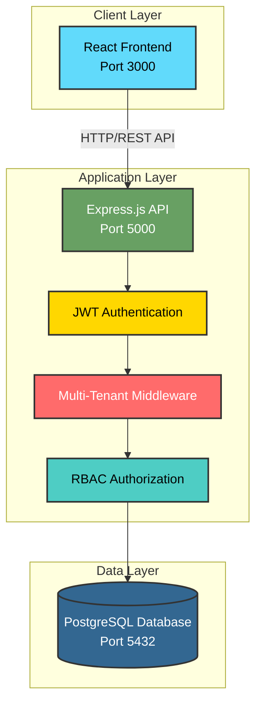
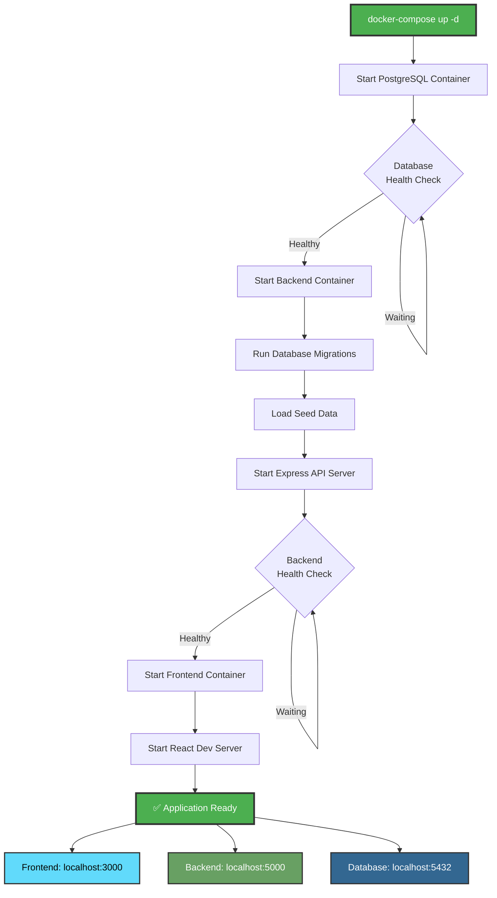
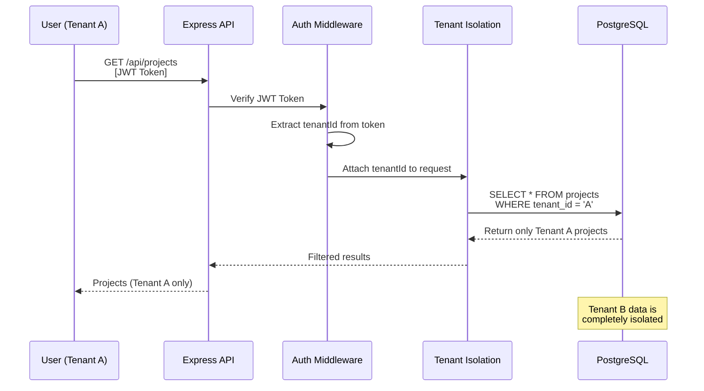

# Multi-Tenant SaaS Platform - Project & Task Management

A production-ready, multi-tenant SaaS application where multiple organizations can independently register, manage teams, create projects, and track tasks with complete data isolation and role-based access control.

## 🚀 Features

- **Multi-Tenancy**: Complete data isolation between organizations using tenant_id filtering
- **Authentication**: JWT-based authentication with bcrypt password hashing
- **Role-Based Access Control**: Three roles (Super Admin, Tenant Admin, User) with different permissions
- **Subscription Management**: Free, Pro, and Enterprise plans with enforced limits
- **Project Management**: Create, update, and track projects with team collaboration
- **Task Management**: Assign tasks, set priorities, track status, and manage deadlines
- **Audit Logging**: Complete audit trail of all system actions
- **Docker Deployment**: Fully containerized with one-command deployment

## 🎥 Demo Video

Watch the complete project demonstration and walkthrough:

[](https://youtu.be/ny8mZUlTj5A)

**[▶️ Watch Demo on YouTube](https://youtu.be/ny8mZUlTj5A)**

## 🏗️ System Architecture



## 🛠️ Technology Stack

### Backend
- **Node.js** v18+ with Express.js
- **PostgreSQL** 15 for data storage
- **JWT** for authentication
- **bcrypt** for password hashing
- **Docker** for containerization

### Frontend
- **React** 18 with React Router
- **Axios** for API requests
- **Modern CSS** with CSS variables

### DevOps
- **Docker** & Docker Compose
- Automatic database migrations
- Health check endpoints

## 📋 Prerequisites

- **Docker Desktop** v20+ (MANDATORY)
- **Docker Compose** v2+
- Git for version control

## 🚀 Quick Start (Docker - MANDATORY)

### 1. Clone Repository
```bash
git clone <repository-url>
cd SaaS
```

### 2. Start All Services
```bash
docker-compose up -d
```

This single command will:
- Start PostgreSQL database (port 5432)
- Run database migrations automatically
- Load seed data automatically
- Start backend API (port 5000)
- Start frontend app (port 3000)



### 3. Access Application
- **Frontend**: http://localhost:3000
- **Backend API**: http://localhost:5000/api
- **Health Check**: http://localhost:5000/api/health

### 4. Test Credentials

**Super Admin:**
- Email: `superadmin@system.com`
- Password: `Admin@123`

**Demo Tenant Admin:**
- Email: `admin@demo.com`
- Password: `Demo@123`
- Tenant: `demo`

**Demo Users:**
- Email: `user1@demo.com` or `user2@demo.com`
- Password: `User@123`
- Tenant: `demo`

## 📁 Project Structure

```
SaaS/
├── backend/                  # Backend API
│   ├── src/
│   │   ├── config/          # Database configuration
│   │   ├── controllers/     # API endpoint logic
│   │   ├── middleware/      # Auth, authorization, error handling
│   │   ├── routes/          # API routes
│   │   ├── utils/           # Helper functions
│   │   └── server.js        # Main server file
│   ├── migrations/          # Database schema migrations
│   ├── seeds/               # Seed data
│   ├── scripts/             # Migration & init scripts
│   ├── Dockerfile
│   ├── package.json
│   └── .env
├── frontend/                # React frontend
│   ├── src/
│   │   ├── components/      # Reusable components
│   │   ├── pages/           # Page components
│   │   ├── context/         # React context (Auth)
│   │   ├── services/        # API service layer
│   │   ├── App.jsx          # Main app component
│   │   └── index.jsx        # Entry point
│   ├── public/
│   ├── Dockerfile
│   ├── package.json
│   └── .env
├── docs/                    # Documentation
│   ├── research.md
│   ├── PRD.md
│   ├── architecture.md
│   ├── technical-spec.md
│   └── API.md
├── docker-compose.yml       # Docker orchestration
├── submission.json          # Test credentials
└── README.md               # This file
```

## 🔌 API Endpoints

### Authentication (4 endpoints)
- `POST /api/auth/register-tenant` - Register new tenant
- `POST /api/auth/login` - User login
- `GET /api/auth/me` - Get current user
- `POST /api/auth/logout` - User logout

### Tenants (3 endpoints)
- `GET /api/tenants` - List all tenants (Super Admin only)
- `GET /api/tenants/:tenantId` - Get tenant details
- `PUT /api/tenants/:tenantId` - Update tenant

### Users (4 endpoints)
- `POST /api/tenants/:tenantId/users` - Add user
- `GET /api/tenants/:tenantId/users` - List users
- `PUT /api/users/:userId` - Update user
- `DELETE /api/users/:userId` - Delete user

### Projects (4 endpoints)
- `POST /api/projects` - Create project
- `GET /api/projects` - List projects
- `PUT /api/projects/:projectId` - Update project
- `DELETE /api/projects/:projectId` - Delete project

### Tasks (4 endpoints)
- `POST /api/projects/:projectId/tasks` - Create task
- `GET /api/projects/:projectId/tasks` - List tasks
- `PATCH /api/tasks/:taskId/status` - Update task status
- `PUT /api/tasks/:taskId` - Update task

### Health (1 endpoint)
- `GET /api/health` - System health check

**Total: 20 API Endpoints**

See [API Documentation](docs/API.md) for detailed information.

## 🔒 Security Features

- **Password Hashing**: bcrypt with cost factor 10
- **JWT Authentication**: 24-hour token expiry
- **Data Isolation**: Tenant-level data filtering
- **Role-Based Access**: Permission checks on all endpoints
- **Audit Logging**: All actions tracked
- **Input Validation**: Server-side validation
- **SQL Injection Prevention**: Parameterized queries

### Multi-Tenancy Data Isolation



## 🧪 Testing

### Manual Testing
```bash
# Access the application
http://localhost:3000

# Try these actions:
1. Register a new tenant
2. Login with demo credentials
3. Create a project
4. Add tasks
5. Assign tasks to users
```

### API Testing
```bash
# Health check
curl http://localhost:5000/api/health

# Login
curl -X POST http://localhost:5000/api/auth/login \
  -H "Content-Type: application/json" \
  -d '{"email":"admin@demo.com","password":"Demo@123","tenantSubdomain":"demo"}'
```

## 📚 Documentation

- [Research Document](docs/research.md) - Multi-tenancy analysis & technology justification
- [PRD](docs/PRD.md) - Product requirements & user personas
- [Architecture](docs/architecture.md) - System architecture & database design
- [Technical Specification](docs/technical-spec.md) - Setup guide & development workflow
- [API Documentation](docs/API.md) - Complete API reference

## 🐳 Docker Commands

```bash
# Start all services
docker-compose up -d

# View logs
docker-compose logs -f

# Stop services
docker-compose down

# Rebuild after code changes
docker-compose up -d --build

# Fresh start (removes volumes)
docker-compose down -v
docker-compose up -d --build
```

## 🔧 Environment Variables

### Backend (.env)
```env
DB_HOST=database
DB_PORT=5432
DB_NAME=saas_db
DB_USER=postgres
DB_PASSWORD=postgres
JWT_SECRET=your-secret-key
JWT_EXPIRES_IN=24h
PORT=5000
FRONTEND_URL=http://frontend:3000
```

### Frontend (.env)
```env
REACT_APP_API_URL=http://localhost:5000/api
```

## 📦 Subscription Plans

| Plan | Max Users | Max Projects | Price |
|------|-----------|--------------|-------|
| Free | 5 | 3 | $0 |
| Pro | 25 | 15 | $29/mo |
| Enterprise | 100 | 50 | $99/mo |

## 🤝 Contributing

This is a learning project. Feel free to fork and experiment!

## 📄 License

MIT License

## 👤 Author

Created as part of the Multi-Tenant SaaS Platform project.

## 🎯 Key Learning Outcomes

- Multi-tenancy architecture patterns
- JWT authentication & authorization
- Database design with proper isolation
- RESTful API best practices
- React application development
- Docker containerization
- Full-stack application deployment

---

**Built with ❤️ using Node.js, React, PostgreSQL, and Docker**
