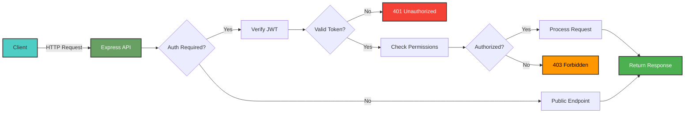
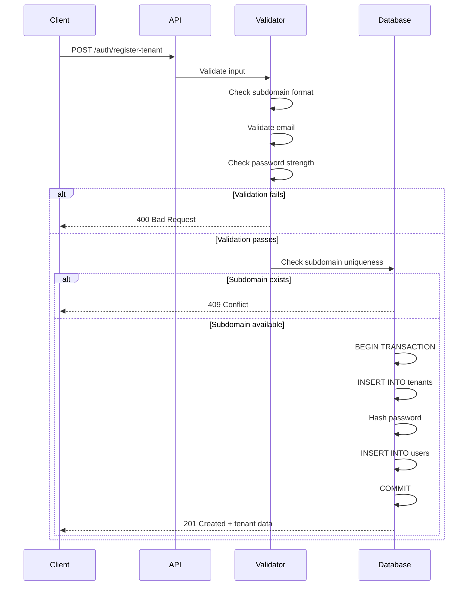
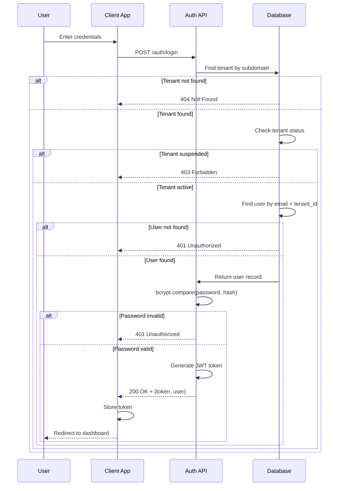
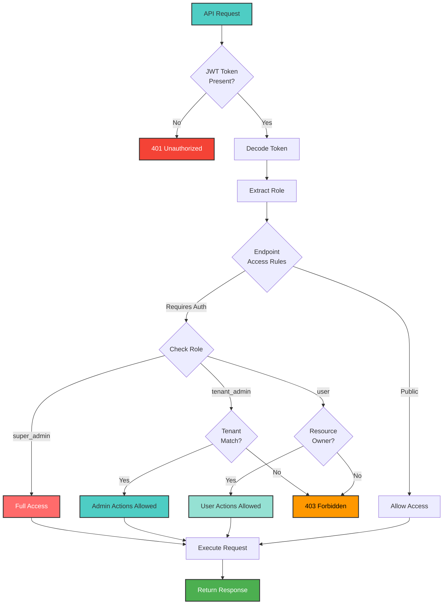

# API Documentation
## Multi-Tenant SaaS Platform

Base URL: `http://localhost:5000/api`

All API responses follow this format:
```json
{
  "success": true/false,
  "data": { ... },
  "message": "Optional message"
}
```

### API Request Flow



## Authentication Module

### 1. Register Tenant
**POST** `/auth/register-tenant`

Register a new tenant organization with admin user.

**Request:**
```json
{
  "tenantName": "Acme Corporation",
  "subdomain": "acme",
  "adminEmail": "admin@acme.com",
  "adminPassword": "SecurePass@123",
  "adminFullName": "John Doe"
}
```

**Success (201):**
```json
{
  "success": true,
  "message": "Tenant registered successfully",
  "data": {
    "tenantId": "uuid",
    "subdomain": "acme",
    "adminUser": {
      "id": "uuid",
      "email": "admin@acme.com",
      "fullName": "John Doe",
      "role": "tenant_admin"
    }
  }
}
```

**Errors:**
- 400: Validation error
- 409: Subdomain or email already exists

**Registration Flow:**



---

### 2. Login
**POST** `/auth/login`

Authenticate user and receive JWT token.

**Request:**
```json
{
  "email": "admin@demo.com",
  "password": "Demo@123",
  "tenantSubdomain": "demo"
}
```

**Success (200):**
```json
{
  "success": true,
  "data": {
    "user": {
      "id": "uuid",
      "email": "admin@demo.com",
      "fullName": "Demo Admin",
      "role": "tenant_admin",
      "tenantId": "uuid"
    },
    "token": "eyJhbGciOiJI...",
    "expiresIn": 86400
  }
}
```

**Errors:**
- 401: Invalid credentials
- 404: Tenant not found
- 403: Account suspended

**Authentication Sequence:**



---

### 3. Get Current User
**GET** `/auth/me`

**Headers:** `Authorization: Bearer {token}`

**Success (200):**
```json
{
  "success": true,
  "data": {
    "id": "uuid",
    "email": "admin@demo.com",
    "fullName": "Demo Admin",
    "role": "tenant_admin",
    "isActive": true,
    "tenant": {
      "id": "uuid",
      "name": "Demo Company",
      "subdomain": "demo",
      "subscriptionPlan": "pro",
      "maxUsers": 25,
      "maxProjects": 15
    }
  }
}
```

---

### 4. Logout
**POST** `/auth/logout`

**Headers:** `Authorization: Bearer {token}`

**Success (200):**
```json
{
  "success": true,
  "message": "Logged out successfully"
}
```

---

## Tenant Management Module

### 5. Get Tenant Details
**GET** `/tenants/:tenantId`

**Headers:** `Authorization: Bearer {token}`

**Authorization:** User must belong to tenant OR be super_admin

**Success (200):**
```json
{
  "success": true,
  "data": {
    "id": "uuid",
    "name": "Demo Company",
    "subdomain": "demo",
    "status": "active",
    "subscriptionPlan": "pro",
    "maxUsers": 25,
    "maxProjects": 15,
    "createdAt": "2026-01-01T00:00:00Z",
    "stats": {
      "totalUsers": 5,
      "totalProjects": 3,
      "totalTasks": 15
    }
  }
}
```

---

### 6. Update Tenant
**PUT** `/tenants/:tenantId`

**Headers:** `Authorization: Bearer {token}`

**Authorization:** tenant_admin (name only) OR super_admin (all fields)

**Request:**
```json
{
  "name": "Updated Company Name",
  "status": "active",
  "subscriptionPlan": "enterprise",
  "maxUsers": 100,
  "maxProjects": 50
}
```

---

### 7. List All Tenants
**GET** `/tenants`

**Headers:** `Authorization: Bearer {token}`

**Authorization:** super_admin ONLY

**Query Parameters:**
- `page`: Page number (default: 1)
- `limit`: Items per page (default: 10)
- `status`: Filter by status
- `subscriptionPlan`: Filter by plan

**Success (200):**
```json
{
  "success": true,
  "data": {
    "tenants": [
      {
        "id": "uuid",
        "name": "Demo Company",
        "subdomain": "demo",
        "status": "active",
        "subscriptionPlan": "pro",
        "totalUsers": 5,
        "totalProjects": 3,
        "createdAt": "2026-01-01T00:00:00Z"
      }
    ],
    "pagination": {
      "currentPage": 1,
      "totalPages": 5,
      "totalTenants": 47,
      "limit": 10
    }
  }
}
```

---

## User Management Module

### 8. Add User
**POST** `/tenants/:tenantId/users`

**Headers:** `Authorization: Bearer {token}`

**Authorization:** tenant_admin only

**Request:**
```json
{
  "email": "newuser@demo.com",
  "password": "SecurePass@123",
  "fullName": "New User",
  "role": "user"
}
```

**Success (201):**
```json
{
  "success": true,
  "message": "User created successfully",
  "data": {
    "id": "uuid",
    "email": "newuser@demo.com",
    "fullName": "New User",
    "role": "user",
    "tenantId": "uuid",
    "isActive": true,
    "createdAt": "2026-01-02T00:00:00Z"
  }
}
```

**Errors:**
- 403: Subscription limit reached
- 409: Email already exists in tenant

---

### 9. List Users
**GET** `/tenants/:tenantId/users`

**Headers:** `Authorization: Bearer {token}`

**Query Parameters:**
- `search`: Search by name or email
- `role`: Filter by role
- `page`: Page number
- `limit`: Items per page

---

### 10. Update User
**PUT** `/users/:userId`

**Headers:** `Authorization: Bearer {token}`

**Authorization:** tenant_admin OR self (limited fields)

**Request:**
```json
{
  "fullName": "Updated Name",
  "role": "tenant_admin",
  "isActive": true
}
```

---

### 11. Delete User
**DELETE** `/users/:userId`

**Headers:** `Authorization: Bearer {token}`

**Authorization:** tenant_admin only

**Success (200):**
```json
{
  "success": true,
  "message": "User deleted successfully"
}
```

**Errors:**
- 403: Cannot delete self

---

## Project Management Module

### 12. Create Project
**POST** `/projects`

**Headers:** `Authorization: Bearer {token}`

**Request:**
```json
{
  "name": "Website Redesign",
  "description": "Complete redesign of company website",
  "status": "active"
}
```

**Errors:**
- 403: Project limit reached

---

### 13. List Projects
**GET** `/projects`

**Headers:** `Authorization: Bearer {token}`

**Query Parameters:**
- `status`: Filter by status
- `search`: Search by name
- `page`: Page number
- `limit`: Items per page

---

### 14. Update Project
**PUT** `/projects/:projectId`

**Headers:** `Authorization: Bearer {token}`

**Authorization:** tenant_admin OR project creator

**Request:**
```json
{
  "name": "Updated Project Name",
  "description": "Updated description",
  "status": "completed"
}
```

---

### 15. Delete Project
**DELETE** `/projects/:projectId`

**Headers:** `Authorization: Bearer {token}`

**Authorization:** tenant_admin OR project creator

---

## Task Management Module

### 16. Create Task
**POST** `/projects/:projectId/tasks`

**Headers:** `Authorization: Bearer {token}`

**Request:**
```json
{
  "title": "Design homepage mockup",
  "description": "Create high-fidelity design",
  "assignedTo": "user-uuid",
  "priority": "high",
  "dueDate": "2026-07-15"
}
```

---

### 17. List Tasks
**GET** `/projects/:projectId/tasks`

**Headers:** `Authorization: Bearer {token}`

**Query Parameters:**
- `status`: Filter by status
- `assignedTo`: Filter by assigned user
- `priority`: Filter by priority
- `search`: Search by title

---

### 18. Update Task Status
**PATCH** `/tasks/:taskId/status`

**Headers:** `Authorization: Bearer {token}`

**Request:**
```json
{
  "status": "completed"
}
```

---

### 19. Update Task
**PUT** `/tasks/:taskId`

**Headers:** `Authorization: Bearer {token}`

**Request:**
```json
{
  "title": "Updated task title",
  "description": "Updated description",
  "status": "in_progress",
  "priority": "high",
  "assignedTo": "user-uuid",
  "dueDate": "2026-08-01"
}
```

---

## Health Check

### 20. Health Check
**GET** `/health`

**Success (200):**
```json
{
  "status": "ok",
  "database": "connected",
  "timestamp": "2026-01-02T00:00:00Z"
}
```

---

## HTTP Status Codes

- **200 OK**: Successful GET/PUT/PATCH/DELETE
- **201 Created**: Successful POST
- **400 Bad Request**: Invalid input
- **401 Unauthorized**: Missing/invalid token
- **403 Forbidden**: Insufficient permissions
- **404 Not Found**: Resource not found
- **409 Conflict**: Duplicate resource
- **500 Internal Server Error**: Server error

---

## Role-Based Access Control (RBAC)


