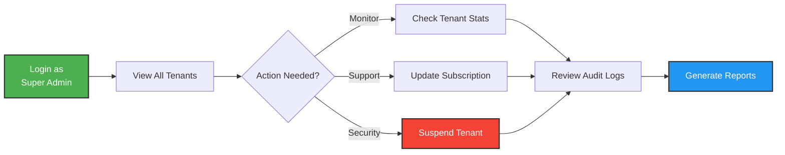
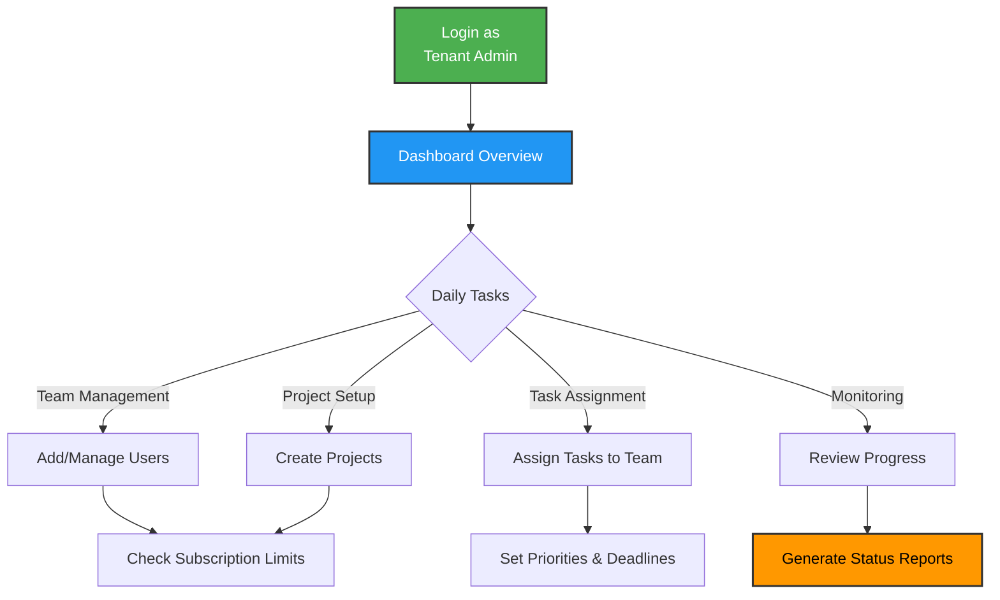
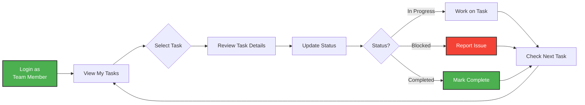
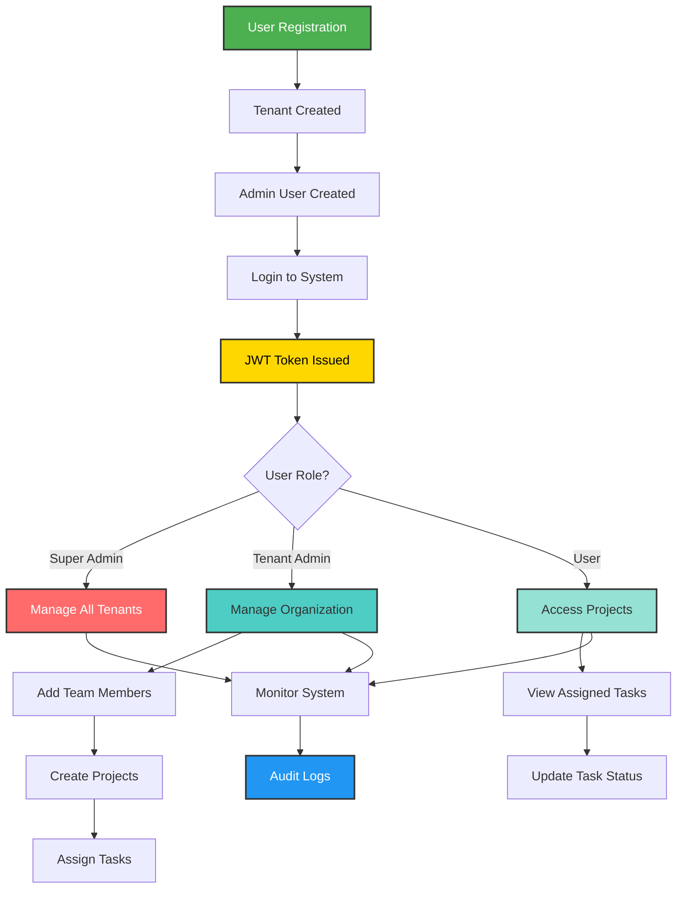

# Product Requirements Document (PRD)
## Multi-Tenant SaaS Platform - Project & Task Management System

---

## 1. User Personas

### Persona 1: Super Admin (System Administrator)

**Name**: Alex Chen  
**Role**: System-Level Administrator  
**Organization**: SaaS Platform Provider

**Description:**  
Alex is responsible for managing the entire SaaS platform infrastructure. They oversee all tenant organizations, monitor system health, and handle escalations.

**Key Responsibilities:**
- Monitor all tenant accounts across the platform
- Manage subscription plans and tenant status
- Investigate security incidents and data anomalies
- Provide technical support to tenant administrators
- Configure system-wide settings and features

**Main Goals:**
- Ensure platform stability and uptime
- Prevent data breaches and maintain tenant isolation
- Optimize resource allocation across tenants
- Provide excellent customer support

**Pain Points:**
- Difficulty tracking tenant activity across the platform
- Time-consuming manual subscription management
- Lack of visibility into cross-tenant analytics
- Complex debugging when tenants report issues

**Workflow:**

---

### Persona 2: Tenant Admin (Organization Administrator)

**Name**: Sarah Martinez  
**Role**: Project Manager / Team Lead  
**Organization**: Demo Company (50-person marketing agency)

**Description:**  
Sarah manages her company's project management workflow. She's responsible for onboarding team members, creating projects, and ensuring efficient task tracking across multiple client campaigns.

**Key Responsibilities:**
- Onboard and manage team member accounts
- Create and organize client projects
- Monitor project progress and team workload
- Ensure tasks are assigned and completed on time
- Generate reports for stakeholders

**Main Goals:**
- Streamline project workflow for her team
- Maintain clear visibility into all active projects
- Enable team collaboration and task transparency
- Stay within subscription plan limits
- Reduce administrative overhead

**Pain Points:**
- Manually tracking project status across spreadsheets
- Difficulty assigning tasks to team members
- No centralized view of team workload
- Subscription limits preventing team growth
- Time wasted on administrative tasks

**Workflow:**

---

### Persona 3: End User (Team Member)

**Name**: Michael Johnson  
**Role**: Senior Designer  
**Organization**: Demo Company

**Description:**  
Michael is a team member who works on multiple projects simultaneously. He needs to track his assigned tasks, update progress, and collaborate with colleagues on project deliverables.

**Key Responsibilities:**
- Complete assigned tasks on time
- Update task status and progress
- Collaborate with team members on projects
- Track deadlines and priorities
- Communicate blockers to project managers

**Main Goals:**
- Clear view of all his assigned tasks
- Easy task status updates
- Visibility into project context
- Prioritize work based on deadlines
- Focus on creative work, not administrative tools

**Pain Points:**
- Email overload with task assignments
- Unclear task priorities across projects
- Lost context when switching between projects
- Manual status update requests from managers
- Complicated project management tools

**Workflow:**

---

## 2. Functional Requirements

### Module 1: Authentication & Authorization

**FR-001**: The system shall allow tenant organizations to register with a unique subdomain, admin email, password, and organization name.

**FR-002**: The system shall validate subdomain uniqueness and prevent duplicate subdomain registration.

**FR-003**: The system shall hash all user passwords using bcrypt before storing in the database.

**FR-004**: The system shall authenticate users via email, password, and tenant subdomain using JWT tokens.

**FR-005**: The system shall generate JWT tokens containing userId, tenantId, and role with 24-hour expiry.

**FR-006**: The system shall support three user roles: super_admin, tenant_admin, and user.

**FR-007**: The system shall enforce role-based access control (RBAC) on all API endpoints.

### Module 2: Multi-Tenancy & Data Isolation

**FR-008**: The system shall isolate tenant data completely using tenant_id filtering on all database queries.

**FR-009**: The system shall prevent users from accessing data belonging to other tenants, even through API manipulation.

**FR-010**: The system shall allow super_admin users to access all tenant data for administrative purposes.

**FR-011**: The system shall associate every data record (except super_admin users) with a tenant via tenant_id foreign key.

### Module 3: Subscription Management

**FR-012**: The system shall support three subscription plans: free (5 users, 3 projects), pro (25 users, 15 projects), and enterprise (100 users, 50 projects).

**FR-013**: The system shall enforce max_users and max_projects limits based on tenant subscription plan.

**FR-014**: The system shall prevent user creation when tenant reaches max_users limit, returning 403 Forbidden.

**FR-015**: The system shall prevent project creation when tenant reaches max_projects limit, returning 403 Forbidden.

**FR-016**: The system shall assign new tenants to the 'free' plan by default during registration.

### Module 4: User Management

**FR-017**: The system shall allow tenant_admin to add new users with email, password, full name, and role (user or tenant_admin).

**FR-018**: The system shall enforce email uniqueness per tenant, allowing the same email across different tenants.

**FR-019**: The system shall allow tenant_admin to list, search, and filter users within their tenant.

**FR-020**: The system shall allow tenant_admin to update user information and deactivate user accounts.

**FR-021**: The system shall prevent tenant_admin from deleting their own account.

**FR-022**: The system shall allow users to update their own profile information (full name).

### Module 5: Project Management

**FR-023**: The system shall allow authenticated users to create projects with name, description, and status.

**FR-024**: The system shall automatically associate projects with the user's tenant and record the creator.

**FR-025**: The system shall allow users to list and search projects within their tenant with status filtering.

**FR-026**: The system shall allow tenant_admin or project creator to update project details (name, description, status).

**FR-027**: The system shall allow tenant_admin or project creator to delete projects.

**FR-028**: The system shall support three project statuses: active, archived, and completed.

### Module 6: Task Management

**FR-029**: The system shall allow users to create tasks within projects with title, description, assigned user, priority, and due date.

**FR-030**: The system shall validate that assigned users belong to the same tenant as the project.

**FR-031**: The system shall allow users to list and filter tasks by status, priority, and assigned user.

**FR-032**: The system shall allow users to update task status (todo, in_progress, completed) via quick update endpoint.

**FR-033**: The system shall allow users to fully update task details including title, description, priority, assignment, and due date.

**FR-034**: The system shall support three task statuses (todo, in_progress, completed) and three priority levels (low, medium, high).

### Module 7: Audit & Compliance

**FR-035**: The system shall log all important actions (user creation, project deletion, etc.) in audit_logs table.

**FR-036**: The system shall record userId, tenantId, action type, entity type, entity ID, and timestamp for each audit event.

---

## Module Interaction Flow

---

## 3. Non-Functional Requirements

### NFR-001: Performance

**Requirement**: The system shall respond to 90% of API requests within 200 milliseconds under normal load conditions.

**Measurement**: Monitor P90 response time using application performance monitoring tools.

**Importance**: Fast response times ensure good user experience and enable real-time collaboration.

### NFR-002: Security

**Requirement**: The system shall implement industry-standard security practices including:
- Password hashing with bcrypt (cost factor 10)
- JWT token expiry (24 hours)
- HTTPS encryption in production (recommended)
- Protection against SQL injection, XSS, and CSRF attacks

**Measurement**: Security audit checklist, penetration testing results.

**Importance**: Protects sensitive tenant data and prevents unauthorized access.

### NFR-003: Scalability

**Requirement**: The system shall support a minimum of 100 concurrent users performing typical operations (viewing projects, updating tasks) without performance degradation.

**Measurement**: Load testing with 100+ concurrent users, monitor response times and error rates.

**Importance**: Enables platform growth as tenant count increases.

### NFR-004: Availability

**Requirement**: The system shall maintain 99% uptime during business hours (9 AM - 6 PM, Monday - Friday).

**Measurement**: Uptime monitoring with alerts for downtime incidents.

**Importance**: Reliable access ensures teams can depend on the platform for daily work.

### NFR-005: Usability

**Requirement**: The system shall provide a responsive web interface that works on desktop (1920x1080), tablet (768x1024), and mobile (375x667) screen sizes.

**Measurement**: Manual testing across device sizes, user feedback surveys.

**Importance**: Enables team members to access the platform from any device.

### NFR-006: Maintainability

**Requirement**: The system shall follow modular architecture with clear separation of concerns (controllers, models, routes, middleware) to enable easy maintenance and feature additions.

**Measurement**: Code review quality metrics, time to implement new features.

**Importance**: Reduces technical debt and enables faster iteration.

### NFR-007: Data Integrity

**Requirement**: The system shall ensure referential integrity through database foreign key constraints and use transactions for critical operations (tenant registration).

**Measurement**: Database constraint violations, data consistency audits.

**Importance**: Prevents data corruption and maintains system reliability.

---

## 4. Success Criteria

The product will be considered successful when:

1. All 19 API endpoints are functional and properly secured
2. Frontend application displays all 6 pages with role-based access
3. Data isolation verified through security testing (no cross-tenant access)
4. Subscription limits enforced correctly
5. Docker deployment works with single command: `docker-compose up -d`
6. Health check endpoint responds successfully
7. All documentation complete and comprehensive
8. Demo video demonstrates all key features

---

## 5. Out of Scope (Future Enhancements)

The following features are explicitly out of scope for the initial version:

- Real-time collaboration (WebSockets)
- File attachments to tasks
- Email notifications
- Password reset functionality
- Two-factor authentication (2FA)
- Mobile native applications
- Advanced reporting and analytics
- API rate limiting
- Tenant-specific branding/customization
- Calendar view for tasks
- Gantt charts for project timelines
- Time tracking functionality
- Comments/discussion threads on tasks
- Webhooks for integrations

---

**Document Version**: 1.0  
**Last Updated**: January 2, 2026  
**Status**: Approved
