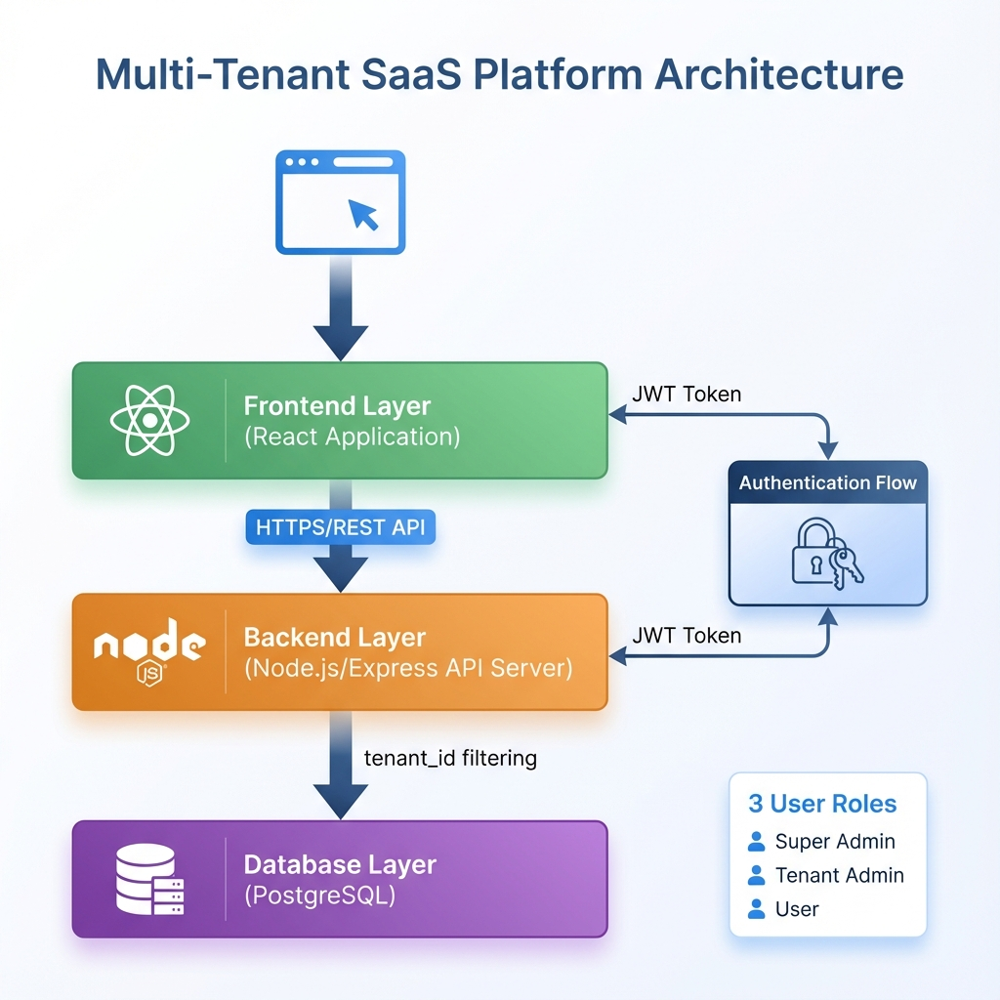
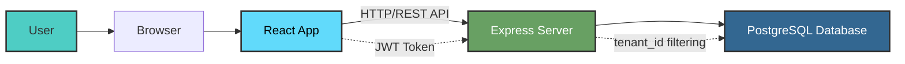
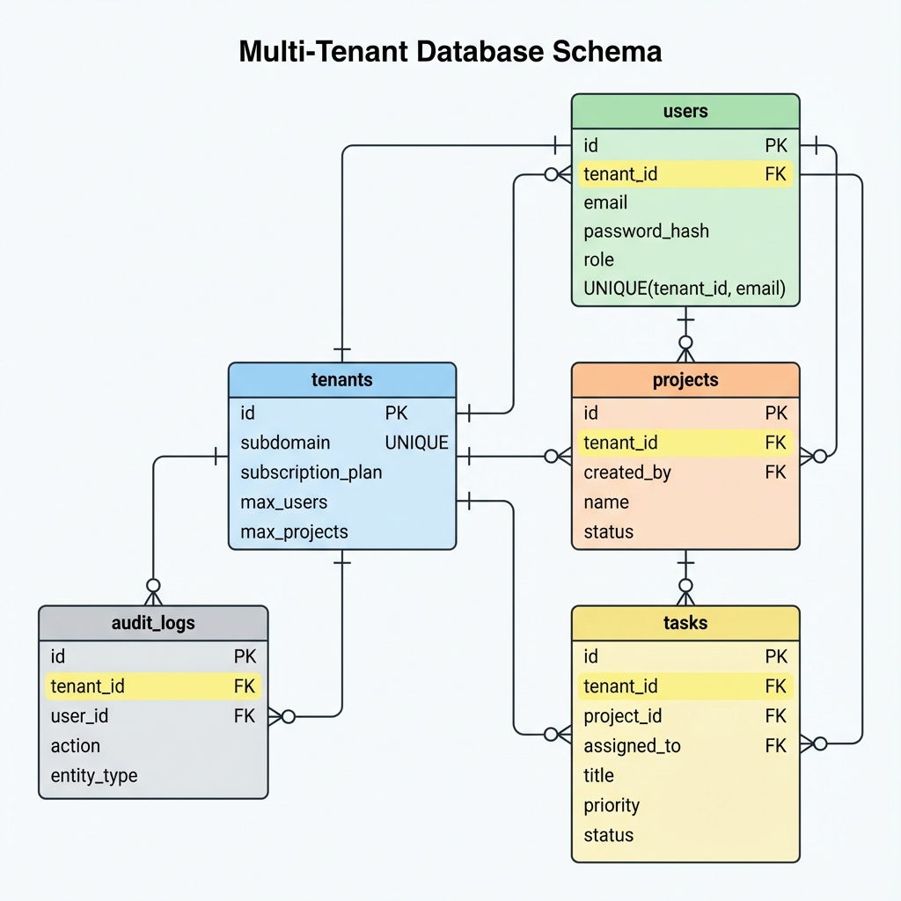
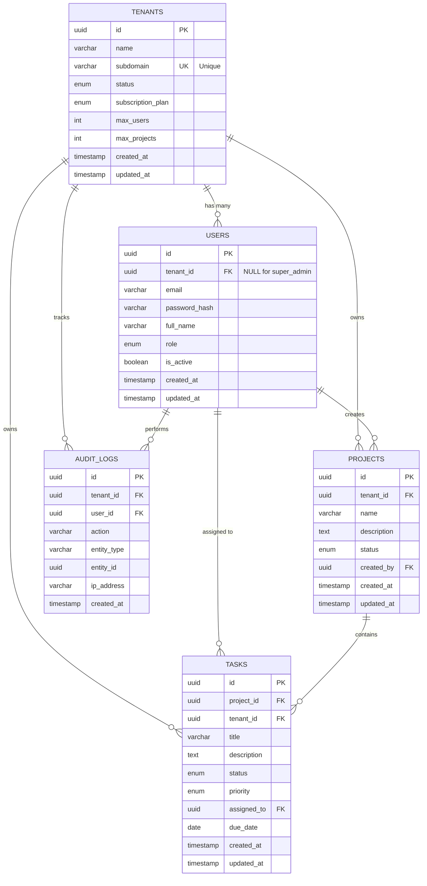
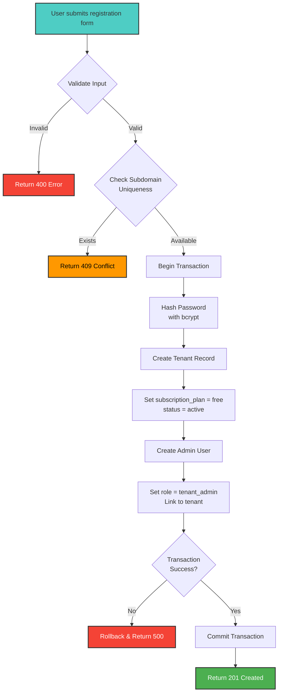
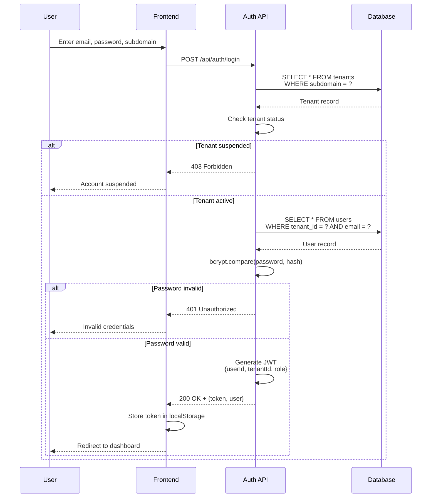
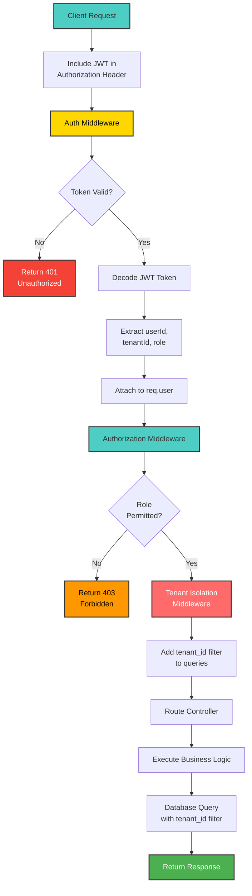
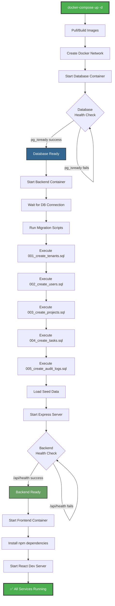

# Architecture Document
## Multi-Tenant SaaS Platform - Project & Task Management System

---

## 1. System Architecture Overview



### Architecture Pattern

The system follows a **three-tier architecture** with clear separation of concerns:

1. **Presentation Layer**: React-based single-page application (SPA)
2. **Application Layer**: Node.js/Express REST API server
3. **Data Layer**: PostgreSQL relational database

### Communication Flow



### Key Architectural Decisions

**Client-Server Separation:**
- Frontend and backend are completely decoupled
- Communication via RESTful JSON APIs
- Enables independent deployment and scaling

**Stateless Authentication:**
- JWT tokens eliminate server-side session storage
- Enables horizontal scaling of API servers
- Token contains: userId, tenantId, role

**Multi-Tenancy Pattern:**
- Shared database with tenant_id column approach
- Application-level data isolation
- Cost-effective and scalable

---

## 2. Database Schema Design



### Database Entity Relationship Diagram



### Table Specifications

#### Table 1: tenants

**Purpose**: Store organization/tenant information and subscription details

| Column | Type | Constraints | Description |
|--------|------|-------------|-------------|
| id | UUID | PRIMARY KEY | Unique tenant identifier |
| name | VARCHAR(255) | NOT NULL | Organization name |
| subdomain | VARCHAR(63) | UNIQUE, NOT NULL | Unique subdomain (e.g., "demo") |
| status | ENUM | NOT NULL | active, suspended, trial |
| subscription_plan | ENUM | NOT NULL | free, pro, enterprise |
| max_users | INTEGER | NOT NULL | Maximum users allowed |
| max_projects | INTEGER | NOT NULL | Maximum projects allowed |
| created_at | TIMESTAMP | NOT NULL | Record creation time |
| updated_at | TIMESTAMP | NOT NULL | Last update time |

**Indexes:**
- PRIMARY KEY on `id`
- UNIQUE INDEX on `subdomain`

---

#### Table 2: users

**Purpose**: Store user accounts with tenant association

| Column | Type | Constraints | Description |
|--------|------|-------------|-------------|
| id | UUID | PRIMARY KEY | Unique user identifier |
| tenant_id | UUID | FOREIGN KEY, NULLABLE | Reference to tenants.id (NULL for super_admin) |
| email | VARCHAR(255) | NOT NULL | User email address |
| password_hash | VARCHAR(255) | NOT NULL | Bcrypt hashed password |
| full_name | VARCHAR(255) | NOT NULL | User's full name |
| role | ENUM | NOT NULL | super_admin, tenant_admin, user |
| is_active | BOOLEAN | DEFAULT true | Account active status |
| created_at | TIMESTAMP | NOT NULL | Record creation time |
| updated_at | TIMESTAMP | NOT NULL | Last update time |

**Constraints:**
- FOREIGN KEY `tenant_id` REFERENCES `tenants(id)` ON DELETE CASCADE
- UNIQUE constraint on `(tenant_id, email)`

**Indexes:**
- PRIMARY KEY on `id`
- INDEX on `tenant_id`
- UNIQUE INDEX on `(tenant_id, email)`

**Note**: Email uniqueness is per-tenant, not global. The same email can exist in different tenants.

---

#### Table 3: projects

**Purpose**: Store projects within each tenant

| Column | Type | Constraints | Description |
|--------|------|-------------|-------------|
| id | UUID | PRIMARY KEY | Unique project identifier |
| tenant_id | UUID | FOREIGN KEY, NOT NULL | Reference to tenants.id |
| name | VARCHAR(255) | NOT NULL | Project name |
| description | TEXT | NULLABLE | Project description |
| status | ENUM | NOT NULL | active, archived, completed |
| created_by | UUID | FOREIGN KEY, NOT NULL | Reference to users.id (creator) |
| created_at | TIMESTAMP | NOT NULL | Record creation time |
| updated_at | TIMESTAMP | NOT NULL | Last update time |

**Constraints:**
- FOREIGN KEY `tenant_id` REFERENCES `tenants(id)` ON DELETE CASCADE
- FOREIGN KEY `created_by` REFERENCES `users(id)` ON DELETE SET NULL

**Indexes:**
- PRIMARY KEY on `id`
- INDEX on `tenant_id`
- INDEX on `created_by`

---

#### Table 4: tasks

**Purpose**: Store tasks within projects

| Column | Type | Constraints | Description |
|--------|------|-------------|-------------|
| id | UUID | PRIMARY KEY | Unique task identifier |
| project_id | UUID | FOREIGN KEY, NOT NULL | Reference to projects.id |
| tenant_id | UUID | FOREIGN KEY, NOT NULL | Reference to tenants.id |
| title | VARCHAR(255) | NOT NULL | Task title |
| description | TEXT | NULLABLE | Task description |
| status | ENUM | NOT NULL | todo, in_progress, completed |
| priority | ENUM | NOT NULL | low, medium, high |
| assigned_to | UUID | FOREIGN KEY, NULLABLE | Reference to users.id |
| due_date | DATE | NULLABLE | Task due date |
| created_at | TIMESTAMP | NOT NULL | Record creation time |
| updated_at | TIMESTAMP | NOT NULL | Last update time |

**Constraints:**
- FOREIGN KEY `project_id` REFERENCES `projects(id)` ON DELETE CASCADE
- FOREIGN KEY `tenant_id` REFERENCES `tenants(id)` ON DELETE CASCADE
- FOREIGN KEY `assigned_to` REFERENCES `users(id)` ON DELETE SET NULL

**Indexes:**
- PRIMARY KEY on `id`
- INDEX on `(tenant_id, project_id)`
- INDEX on `assigned_to`
- INDEX on `status`

---

#### Table 5: audit_logs

**Purpose**: Track all important actions for security and compliance

| Column | Type | Constraints | Description |
|--------|------|-------------|-------------|
| id | UUID | PRIMARY KEY | Unique log identifier |
| tenant_id | UUID | FOREIGN KEY, NULLABLE | Reference to tenants.id |
| user_id | UUID | FOREIGN KEY, NULLABLE | Reference to users.id |
| action | VARCHAR(100) | NOT NULL | Action type (e.g., CREATE_USER) |
| entity_type | VARCHAR(50) | NULLABLE | Entity type (user, project, task) |
| entity_id | UUID | NULLABLE | ID of affected entity |
| ip_address | VARCHAR(45) | NULLABLE | User's IP address |
| created_at | TIMESTAMP | NOT NULL | Log entry timestamp |

**Constraints:**
- FOREIGN KEY `tenant_id` REFERENCES `tenants(id)` ON DELETE CASCADE
- FOREIGN KEY `user_id` REFERENCES `users(id)` ON DELETE SET NULL

**Indexes:**
- PRIMARY KEY on `id`
- INDEX on `tenant_id`
- INDEX on `user_id`
- INDEX on `created_at` (for time-based queries)

---

### Multi-Tenancy Implementation

**Data Isolation Strategy:**

Every table (except `users` for super_admin) contains a `tenant_id` column that:
1. Links the record to its owning tenant
2. Is automatically filtered in all queries (middleware layer)
3. Is indexed for query performance
4. Prevents cross-tenant data access

**Example Query Flow:**
```sql
-- User request: Get all projects
-- Without middleware (WRONG):
SELECT * FROM projects;

-- With middleware (CORRECT):
SELECT * FROM projects WHERE tenant_id = '123e4567-e89b-12d3-a456-426614174000';
```

---

## 3. API Architecture

### API Endpoint Organization

All API endpoints are prefixed with `/api` and organized by module:

#### Authentication Module (4 endpoints)

| Method | Endpoint | Auth | Role | Description |
|--------|----------|------|------|-------------|
| POST | /api/auth/register-tenant | No | Public | Register new tenant organization |
| POST | /api/auth/login | No | Public | User login |
| GET | /api/auth/me | Yes | All | Get current user info |
| POST | /api/auth/logout | Yes | All | User logout |

#### Tenant Management Module (3 endpoints)

| Method | Endpoint | Auth | Role | Description |
|--------|----------|------|------|-------------|
| GET | /api/tenants/:tenantId | Yes | Owner/Admin | Get tenant details |
| PUT | /api/tenants/:tenantId | Yes | Admin/Super | Update tenant |
| GET | /api/tenants | Yes | Super | List all tenants |

#### User Management Module (4 endpoints)

| Method | Endpoint | Auth | Role | Description |
|--------|----------|------|------|-------------|
| POST | /api/tenants/:tenantId/users | Yes | Tenant Admin | Add new user |
| GET | /api/tenants/:tenantId/users | Yes | All (same tenant) | List users |
| PUT | /api/users/:userId | Yes | Admin/Self | Update user |
| DELETE | /api/users/:userId | Yes | Tenant Admin | Delete user |

#### Project Management Module (4 endpoints)

| Method | Endpoint | Auth | Role | Description |
|--------|----------|------|------|-------------|
| POST | /api/projects | Yes | All | Create project |
| GET | /api/projects | Yes | All | List projects |
| PUT | /api/projects/:projectId | Yes | Admin/Creator | Update project |
| DELETE | /api/projects/:projectId | Yes | Admin/Creator | Delete project |

#### Task Management Module (4 endpoints)

| Method | Endpoint | Auth | Role | Description |
|--------|----------|------|------|-------------|
| POST | /api/projects/:projectId/tasks | Yes | All | Create task |
| GET | /api/projects/:projectId/tasks | Yes | All | List tasks |
| PATCH | /api/tasks/:taskId/status | Yes | All | Update task status |
| PUT | /api/tasks/:taskId | Yes | All | Update task |

#### System Health (1 endpoint)

| Method | Endpoint | Auth | Role | Description |
|--------|----------|------|------|-------------|
| GET | /api/health | No | Public | System health check |

**Total: 20 API Endpoints**

---

### API Response Format

All API responses follow a consistent format:

**Success Response:**
```json
{
  "success": true,
  "data": {
    // Response data here
  },
  "message": "Optional success message"
}
```

**Error Response:**
```json
{
  "success": false,
  "message": "Error description",
  "errors": [
    // Optional validation errors array
  ]
}
```

**HTTP Status Codes:**
- `200 OK`: Successful GET/PUT/PATCH/DELETE
- `201 Created`: Successful POST
- `400 Bad Request`: Validation errors
- `401 Unauthorized`: Missing/invalid token
- `403 Forbidden`: Insufficient permissions
- `404 Not Found`: Resource not found
- `409 Conflict`: Duplicate resource (e.g., subdomain exists)
- `500 Internal Server Error`: Server errors

---

## 4. Authentication & Authorization Flow

### Registration Flow



### Login Flow



### API Request Flow with Authentication



---

## 5. Middleware Architecture

### Middleware Stack (in order of execution)

1. **CORS Middleware**: Handle cross-origin requests
2. **Body Parser**: Parse JSON request bodies
3. **Morgan Logger**: Log HTTP requests
4. **Helmet**: Set security headers
5. **Authentication Middleware**: Verify JWT token (on protected routes)
6. **Authorization Middleware**: Check user role
7. **Tenant Isolation Middleware**: Filter queries by tenant_id
8. **Route Controllers**: Business logic
9. **Error Handler Middleware**: Catch and format errors

### Custom Middleware Functions

**Authentication Middleware** (`middleware/auth.js`):
```javascript
// Pseudo-code
function authenticate(req, res, next) {
  const token = req.headers.authorization?.split(' ')[1];
  if (!token) return 401 Unauthorized;
  
  const decoded = jwt.verify(token, SECRET);
  req.user = decoded; // {userId, tenantId, role}
  next();
}
```

**Authorization Middleware** (`middleware/authorize.js`):
```javascript
// Pseudo-code
function authorize(allowedRoles) {
  return (req, res, next) => {
    if (!allowedRoles.includes(req.user.role)) {
      return 403 Forbidden;
    }
    next();
  };
}
```

**Tenant Isolation Middleware** (`middleware/tenantIsolation.js`):
```javascript
// Pseudo-code
function tenantIsolation(req, res, next) {
  // Attach tenant filter to database query helper
  req.tenantFilter = {
    tenant_id: req.user.tenantId
  };
  // Super admin can bypass
  if (req.user.role === 'super_admin') {
    req.tenantFilter = {};
  }
  next();
}
```

---

## 6. Frontend Architecture

### Component Hierarchy

```
App
├── AuthProvider (Context)
│   ├── Login Page
│   ├── Register Page
│   └── Protected Routes
│       ├── Navigation
│       ├── Dashboard
│       ├── Projects List
│       │   └── Project Card
│       ├── Project Details
│       │   └── Task Item
│       └── Users List
│           └── User Modal
```

### State Management

**Authentication State** (React Context):
- Current user information
- JWT token
- Login/logout functions
- Auto-check token on app load

**Component-Level State** (useState):
- Form inputs
- Loading states
- Error messages
- Modal visibility

### Routing Structure

| Route | Component | Access |
|-------|-----------|--------|
| /register | RegisterPage | Public |
| /login | LoginPage | Public |
| /dashboard | Dashboard | Protected |
| /projects | ProjectsList | Protected |
| /projects/:id | ProjectDetails | Protected |
| /users | UsersList | Protected (Tenant Admin) |

---

## 7. Security Architecture

### Defense in Depth Strategy

**Layer 1 - Network Security:**
- HTTPS encryption (production)
- CORS whitelist
- Security headers (Helmet)

**Layer 2 - Authentication:**
- JWT with expiry
- Bcrypt password hashing
- Secure token storage

**Layer 3 - Authorization:**
- Role-based access control
- Endpoint-level permissions
- Resource ownership checks

**Layer 4 - Data Isolation:**
- Tenant ID filtering (middleware)
- Database constraints
- Query parameterization

**Layer 5 - Input Validation:**
- Server-side validation
- SQL injection prevention
- XSS protection (React auto-escaping)

**Layer 6 - Audit & Monitoring:**
- Audit logs for all actions
- Failed auth attempt logging
- Security event monitoring

---

## 8. Deployment Architecture (Docker)

### Container Structure

```
Docker Network (bridge)
├── database (PostgreSQL container)
│   └── Port 5432:5432
│   └── Volume: db_data
├── backend (Node.js container)
│   └── Port 5000:5000
│   └── Depends on: database
└── frontend (React container)
    └── Port 3000:3000
    └── Depends on: backend
```

### Service Communication

- **Frontend → Backend**: `http://backend:5000/api` (Docker network)
- **Backend → Database**: `postgresql://database:5432` (Docker network)
- **External Access**: 
  - Frontend: `http://localhost:3000`
  - Backend: `http://localhost:5000`
  - Database: `localhost:5432`

### Deployment Process



---

## 9. Scalability Considerations

### Current Architecture (Single Server)

Suitable for: 100-1000 tenants, 1000-5000 concurrent users

### Future Scaling Path

**Horizontal Scaling:**
1. Multiple backend instances behind load balancer
2. Stateless JWT enables easy horizontal scaling
3. Database connection pooling

**Database Scaling:**
1. Read replicas for reporting queries
2. Partitioning by tenant_id for large datasets
3. Caching layer (Redis) for frequently accessed data

**CDN for Frontend:**
1. Serve static assets from CDN
2. Reduce backend load

---

## 10. Technology Stack Summary

| Layer | Technology | Version | Purpose |
|-------|------------|---------|---------|
| Frontend | React | 18.2+ | UI framework |
| Routing | React Router | 6.x | Client-side routing |
| HTTP Client | Axios | 1.x | API requests |
| Backend | Node.js | 18+ | Runtime |
| Framework | Express | 4.18+ | Web framework |
| Database | PostgreSQL | 15 | Data storage |
| Auth | JWT | - | Authentication |
| Password | bcrypt | - | Password hashing |
| Containerization | Docker | 20+ | Container runtime |
| Orchestration | Docker Compose | 2.x | Multi-container apps |

---

**Document Version**: 1.0  
**Last Updated**: January 2, 2026  
**Status**: Approved
