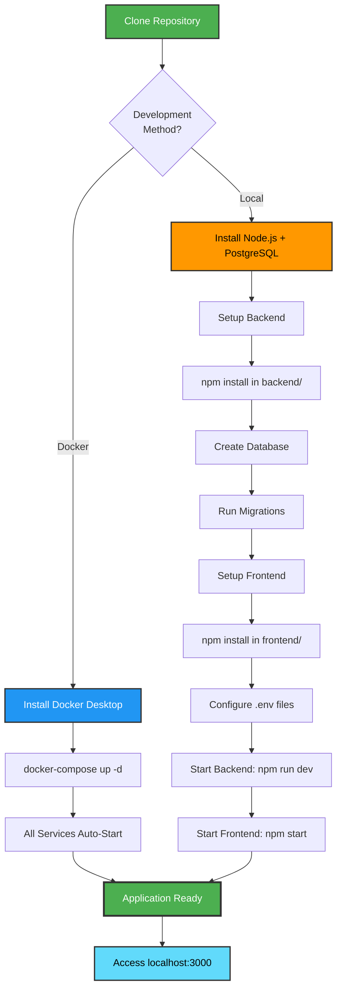
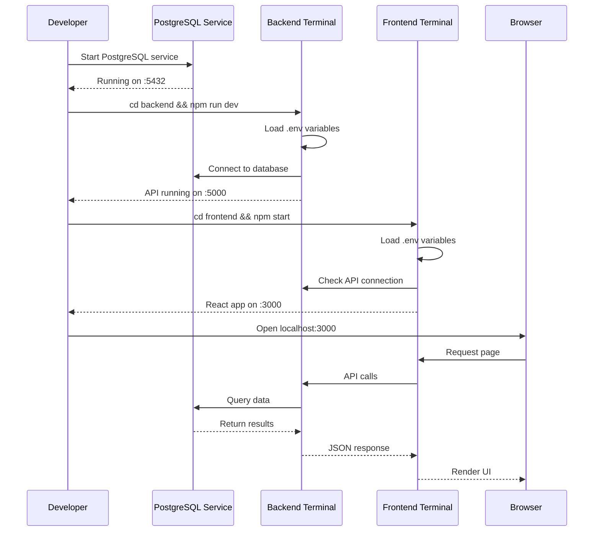

# Technical Specification Document
## Multi-Tenant SaaS Platform - Project & Task Management System

---

## 1. Project Structure

### Complete Directory Layout

```
SaaS/
├── backend/
│   ├── src/
│   │   ├── config/
│   │   │   └── database.js          # Database connection configuration
│   │   ├── controllers/
│   │   │   ├── authController.js    # Authentication endpoints logic
│   │   │   ├── tenantController.js  # Tenant management logic
│   │   │   ├── userController.js    # User management logic
│   │   │   ├── projectController.js # Project management logic
│   │   │   └── taskController.js    # Task management logic
│   │   ├── middleware/
│   │   │   ├── authenticate.js      # JWT verification
│   │   │   ├── authorize.js         # Role-based access control
│   │   │   ├── tenantIsolation.js   # Automatic tenant_id filtering
│   │   │   ├── errorHandler.js      # Global error handling
│   │   │   └── validator.js         # Request validation
│   │   ├── routes/
│   │   │   ├── authRoutes.js        # /api/auth/* routes
│   │   │   ├── tenantRoutes.js      # /api/tenants/* routes
│   │   │   ├── userRoutes.js        # /api/users/* routes
│   │   │   ├── projectRoutes.js     # /api/projects/* routes
│   │   │   ├── taskRoutes.js        # /api/tasks/* routes
│   │   │   └── index.js             # Main router
│   │   ├── utils/
│   │   │   ├── auditLogger.js       # Audit logging utility
│   │   │   ├── passwordHash.js      # Bcrypt wrapper
│   │   │   └── jwtHelper.js         # JWT generation/verification
│   │   └── server.js                # Main application entry point
│   ├── migrations/
│   │   ├── 001_create_tenants.sql
│   │   ├── 002_create_users.sql
│   │   ├── 003_create_projects.sql
│   │   ├── 004_create_tasks.sql
│   │   └── 005_create_audit_logs.sql
│   ├── seeds/
│   │   └── seed_data.sql            # Initial data (super admin, demo tenant, users)
│   ├── scripts/
│   │   ├── init-db.sh               # Database initialization script
│   │   └── run-migrations.js        # Migration runner
│   ├── .env.example                 # Environment variables template
│   ├── .env                         # Actual environment variables (committed for evaluation)
│   ├── .dockerignore
│   ├── Dockerfile
│   ├── package.json
│   └── package-lock.json
│
├── frontend/
│   ├── public/
│   │   ├── index.html
│   │   └── favicon.ico
│   ├── src/
│   │   ├── components/
│   │   │   ├── Navigation.jsx       # Navigation bar with role-based menu
│   │   │   ├── ProtectedRoute.jsx   # Route guard component
│   │   │   ├── ProjectCard.jsx      # Project display card
│   │   │   ├── TaskItem.jsx         # Task list item
│   │   │   ├── UserModal.jsx        # Add/Edit user modal
│   │   │   └── StatsCard.jsx        # Dashboard statistics card
│   │   ├── pages/
│   │   │   ├── Register.jsx         # Tenant registration page
│   │   │   ├── Login.jsx            # User login page
│   │   │   ├── Dashboard.jsx        # Main dashboard
│   │   │   ├── ProjectsList.jsx     # Projects list view
│   │   │   ├── ProjectDetails.jsx   # Project details with tasks
│   │   │   └── UsersList.jsx        # User management page
│   │   ├── context/
│   │   │   └── AuthContext.jsx      # Authentication state management
│   │   ├── services/
│   │   │   └── api.js               # Axios instance and API calls
│   │   ├── styles/
│   │   │   └── index.css            # Global styles with CSS variables
│   │   ├── App.jsx                  # Main app component with routing
│   │   └── index.jsx                # React entry point
│   ├── .env.example
│   ├── .env                         # Frontend environment variables
│   ├── .dockerignore
│   ├── Dockerfile
│   ├── package.json
│   └── package-lock.json
│
├── docs/
│   ├── images/
│   │   ├── system-architecture.png
│   │   └── database-erd.png
│   ├── research.md                  # Multi-tenancy research
│   ├── PRD.md                       # Product requirements
│   ├── architecture.md              # Architecture documentation
│   ├── technical-spec.md            # This file
│   └── API.md                       # API documentation
│
├── docker-compose.yml               # Docker orchestration
├── .gitignore
├── submission.json                  # Test credentials for evaluation
└── README.md                        # Main project documentation
```

---

## 2. Technology Requirements

### Development Environment

**Required Software:**
- **Node.js**: v18.0.0 or higher
- **npm**: v9.0.0 or higher
- **PostgreSQL**: v15.0 or higher (for local development without Docker)
- **Docker**: v20.0.0 or higher (MANDATORY for deployment)
- **Docker Compose**: v2.0.0 or higher

**Recommended Tools:**
- **VS Code**: Code editor with extensions (ESLint, Prettier, Docker)
- **Postman**: API testing
- **pgAdmin** or **DBeaver**: Database management GUI
- **Git**: Version control

---

## 3. Backend Setup Guide

### Step 1: Navigate to Backend Directory

```bash
cd backend
```

### Step 2: Initialize Node.js Project

```bash
npm init -y
```

### Step 3: Install Dependencies

**Production Dependencies:**
```bash
npm install express pg cors dotenv jsonwebtoken bcrypt express-validator helmet morgan uuid
```

Package purposes:
- `express`: Web framework
- `pg`: PostgreSQL client
- `cors`: Cross-Origin Resource Sharing
- `dotenv`: Environment variables
- `jsonwebtoken`: JWT authentication
- `bcrypt`: Password hashing
- `express-validator`: Request validation
- `helmet`: Security headers
- `morgan`: HTTP logging
- `uuid`: Generate UUIDs

**Development Dependencies:**
```bash
npm install --save-dev nodemon
```

### Step 4: Configure Environment Variables

Create `.env` file:
```env
# Database
DB_HOST=localhost
DB_PORT=5432
DB_NAME=saas_db
DB_USER=postgres
DB_PASSWORD=postgres

# JWT
JWT_SECRET=your-super-secret-jwt-key-min-32-characters-long-change-in-production
JWT_EXPIRES_IN=24h

# Server
PORT=5000
NODE_ENV=development

# Frontend URL (for CORS)
FRONTEND_URL=http://localhost:3000
```

**IMPORTANT**: For Docker deployment, these values will be different:
```env
DB_HOST=database          # Docker service name, not localhost
FRONTEND_URL=http://frontend:3000    # Docker service name
```

### Step 5: Update package.json Scripts

```json
{
  "scripts": {
    "start": "node src/server.js",
    "dev": "nodemon src/server.js",
    "migrate": "node scripts/run-migrations.js"
  }
}
```

### Step 6: Create Database (Local Development)

```bash
# Using psql command line
psql -U postgres -c "CREATE DATABASE saas_db;"
```

### Step 7: Run Migrations

```bash
npm run migrate
```

### Step 8: Start Development Server

```bash
npm run dev
```

Server will start at `http://localhost:5000`

---

## 4. Frontend Setup Guide

### Step 1: Navigate to Frontend Directory

```bash
cd frontend
```

### Step 2: Create React App

```bash
npx create-react-app .
```

Or use Vite for faster development:
```bash
npm create vite@latest . -- --template react
```

### Step 3: Install Dependencies

```bash
npm install react-router-dom axios
```

Package purposes:
- `react-router-dom`: Client-side routing
- `axios`: HTTP client for API calls

### Step 4: Configure Environment Variables

Create `.env` file:
```env
REACT_APP_API_URL=http://localhost:5000/api
```

For Docker:
```env
REACT_APP_API_URL=http://backend:5000/api
```

**Note**: React requires environment variables to start with `REACT_APP_`

### Step 5: Update package.json Scripts

```json
{
  "scripts": {
    "start": "react-scripts start",
    "build": "react-scripts build",
    "test": "react-scripts test",
    "eject": "react-scripts eject"
  }
}
```

### Step 6: Start Development Server

```bash
npm start
```

Frontend will open at `http://localhost:3000`

---

## 5. Database Setup Guide

### Local Development Setup (Without Docker)

**Step 1: Install PostgreSQL**
- Download from https://www.postgresql.org/download/
- Install with default settings
- Remember the postgres user password

**Step 2: Create Database**
```bash
psql -U postgres
CREATE DATABASE saas_db;
\c saas_db
```

**Step 3: Run Migrations**
```bash
cd backend
npm run migrate
```

**Step 4: Load Seed Data**
```bash
psql -U postgres -d saas_db -f seeds/seed_data.sql
```

### Docker Setup (Production/Evaluation)

Database initialization is AUTOMATIC. When running `docker-compose up -d`:
1. PostgreSQL container starts with volume
2. Backend waits for database health check
3. Backend automatically runs migrations
4. Backend automatically loads seed data
5. Application ready to use

---

## 6. Docker Setup Guide (MANDATORY)

### Prerequisites

**Install Docker Desktop:**
- Windows: https://docs.docker.com/desktop/install/windows-install/
- Ensure WSL 2 backend is enabled

### Docker Compose Configuration

The `docker-compose.yml` in the project root defines all three services:

**Service Configuration:**
```yaml
services:
  database:
    - PostgreSQL 15
    - Port: 5432 (external) → 5432 (internal)
    - Volume: db_data for persistence
    - Health check: pg_isready
  
  backend:
    - Custom Node.js image
    - Port: 5000 (external) → 5000 (internal)
    - Depends on: database (healthy)
    - Health check: curl /api/health
    - Auto-runs migrations and seeds
  
  frontend:
    - Custom React image  
    - Port: 3000 (external) → 3000 (internal)
    - Depends on: backend (healthy)
```

### Running with Docker

**Start all services:**
```bash
cd SaaS
docker-compose up -d
```

**Check status:**
```bash
docker-compose ps
```

All three services should show "Up" status.

**View logs:**
```bash
docker-compose logs -f backend
docker-compose logs -f frontend
docker-compose logs -f database
```

**Stop all services:**
```bash
docker-compose down
```

**Stop and remove volumes (fresh start):**
```bash
docker-compose down -v
```

### Health Check Verification

Once started, verify health:
```bash
curl http://localhost:5000/api/health
```

Expected response:
```json
{
  "status": "ok",
  "database": "connected"
}
```

### Accessing Services

- **Frontend**: http://localhost:3000
- **Backend API**: http://localhost:5000/api
- **Database**: localhost:5432 (use pgAdmin or DBeaver)

---

## 7. Development Workflow

### Development Setup Overview



### Daily Development Process

**1. Start Services (Docker):**
```bash
docker-compose up -d
```

**2. Watch Logs:**
```bash
docker-compose logs -f backend frontend
```

**3. Make Code Changes**
- Backend: Changes require container rebuild or volume mounting
- Frontend: Changes hot-reload if dev server is configured

**4. Rebuild After Changes:**
```bash
docker-compose up -d --build
```

**5. Test Endpoints:**
Use Postman or curl to test API endpoints

**6. Stop Services:**
```bash
docker-compose down
```

### Local Development (Without Docker)



**Terminal 1 - Backend:**
```bash
cd backend
npm run dev
```

**Terminal 2 - Frontend:**
```bash
cd frontend
npm start
```

**Terminal 3 - Database:**
PostgreSQL runs as system service (already started)

---

## 8. Code Quality Guidelines

### Backend Code Style

**File Naming:**
- Controllers: `{module}Controller.js` (camelCase)
- Routes: `{module}Routes.js`
- Middleware: `{purpose}.js` (camelCase)

**Function Naming:**
- Async functions: `async functionName()`
- Controllers: `createUser`, `getProjects`, `updateTask`

**Error Handling:**
```javascript
try {
  // Business logic
} catch (error) {
  console.error('Error:', error);
  return res.status(500).json({
    success: false,
    message: 'Internal server error'
  });
}
```

### Frontend Code Style

**Component Naming:**
- Components: `ComponentName.jsx` (PascalCase)
- Pages: `PageName.jsx`

**File Organization:**
- One component per file
- Import order: React, libraries, components, styles

**Props Destructuring:**
```javascript
function Component({ propOne, propTwo }) {
  // Component logic
}
```

---

## 9. Testing Strategy

### Manual Testing Checklist

**Authentication:**
- [ ] Register new tenant with unique subdomain
- [ ] Login with correct credentials
- [ ] Login with wrong password (should fail)
- [ ] Access protected route without token (should redirect)

**Multi-Tenancy:**
- [ ] Login as Tenant A, create project
- [ ] Login as Tenant B, verify cannot see Tenant A's project
- [ ] Attempt API manipulation with different tenant_id (should fail)

**Subscription Limits:**
- [ ] Add users up to max_users limit
- [ ] Attempt to add one more user (should fail with 403)
- [ ] Same for projects

**Role-Based Access:**
- [ ] Login as regular user, attempt to add user (should fail)
- [ ] Login as tenant_admin, add user (should succeed)
- [ ] Login as super_admin, access all tenants (should succeed)

### API Testing with Postman

Import these test scenarios:
1. Tenant registration
2. Login (get JWT token)
3. Get current user (with token)
4. Create project
5. Create task
6. Cross-tenant access attempt (should fail)

---

## 10. Deployment Checklist

### Pre-Deployment Verification

- [ ] All 20 API endpoints functional
- [ ] All 6 frontend pages accessible
- [ ] Docker Compose builds successfully
- [ ] Health check endpoint responds
- [ ] Migrations run automatically
- [ ] Seed data loads automatically
- [ ] Environment variables documented
- [ ] submission.json contains test credentials
- [ ] README.md complete

### Docker Deployment Verification

```bash
# 1. Clean start
docker-compose down -v

# 2. Build and start
docker-compose up -d --build

# 3. Wait for services (30-60 seconds)
timeout /t 60

# 4. Check health
curl http://localhost:5000/api/health

# 5. Test login
curl -X POST http://localhost:5000/api/auth/login \
  -H "Content-Type: application/json" \
  -d "{\"email\":\"superadmin@system.com\",\"password\":\"Admin@123\"}"

# 6. Access frontend
# Open http://localhost:3000 in browser
```

---

## 11. Troubleshooting Guide

### Common Issues

**Issue: Database connection failed**
- Solution: Check DB_HOST in .env (should be "database" for Docker)
- Verify database container is running: `docker-compose ps database`

**Issue: Migrations don't run automatically**
- Solution: Check backend entrypoint script
- View logs: `docker-compose logs backend`

**Issue: Frontend can't connect to backend**
- Solution: Check REACT_APP_API_URL uses service name "backend" not "localhost"
- Verify CORS configuration in backend allows frontend URL

**Issue: Port already in use**
- Solution: Stop existing services on ports 3000, 5000, or 5432
- Or change port mappings in docker-compose.yml

**Issue: Permissions error in Docker**
- Solution: Run Docker Desktop as administrator (Windows)

---

## 12. Security Checklist

### Before Production

- [ ] Change JWT_SECRET to strong random value
- [ ] Change all default passwords
- [ ] Enable HTTPS
- [ ] Set NODE_ENV=production
- [ ] Remove .env from .gitignore (for evaluation) or use environment variables
- [ ] Implement rate limiting on login endpoint
- [ ] Add helmet security headers
- [ ] Configure CORS whitelist properly
- [ ] Review all SQL queries for injection vulnerabilities
- [ ] Test authentication bypass attempts
- [ ] Verify audit logging works

---

## 13. Environment Variables Reference

### Backend Environment Variables

| Variable | Description | Example | Required |
|----------|-------------|---------|----------|
| DB_HOST | Database hostname | database | Yes |
| DB_PORT | Database port | 5432 | Yes |
| DB_NAME | Database name | saas_db | Yes |
| DB_USER | Database username | postgres | Yes |
| DB_PASSWORD | Database password | postgres | Yes |
| JWT_SECRET | Secret key for JWT | (long random string) | Yes |
| JWT_EXPIRES_IN | Token expiry time | 24h | Yes |
| PORT | Server port | 5000 | Yes |
| NODE_ENV | Environment | development/production | Yes |
| FRONTEND_URL | Frontend URL for CORS | http://frontend:3000 | Yes |

### Frontend Environment Variables

| Variable | Description | Example | Required |
|----------|-------------|---------|----------|
| REACT_APP_API_URL | Backend API URL | http://backend:5000/api | Yes |

---

## 14. Git Workflow

### Commit Messages

Follow conventional commits:
```
feat: Add user management endpoints
fix: Resolve tenant isolation bug
docs: Update API documentation
style: Format code with prettier
refactor: Simplify authentication middleware
test: Add login endpoint tests
chore: Update dependencies
```

### Branching Strategy (Optional)

- `main`: Production-ready code
- `develop`: Integration branch
- `feature/*`: Feature branches

---

**Document Version**: 1.0  
**Last Updated**: January 2, 2026  
**Status**: Approved
